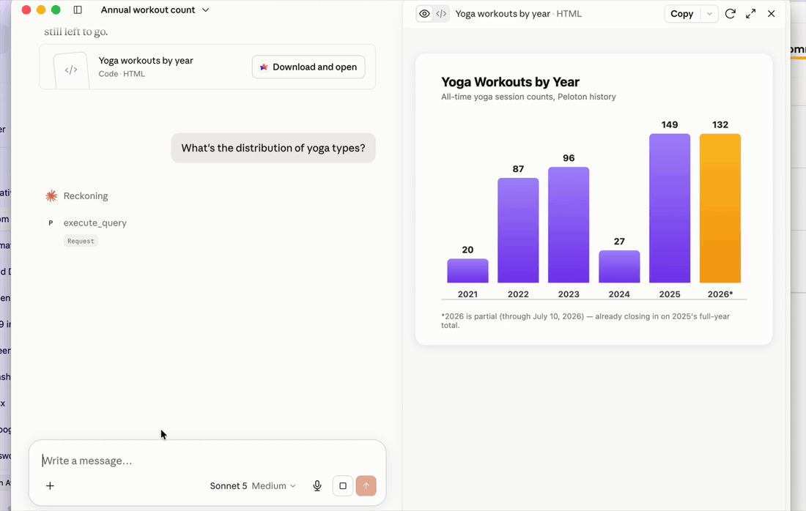
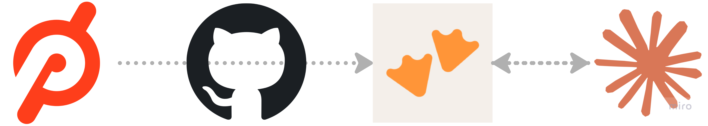

# peloton-motherduck

Sync your Peloton workout history into [MotherDuck](https://motherduck.com), then
query it conversationally through the Model Context Protocol (MCP).

[](https://github.com/user-attachments/assets/3f195047-f3cc-4037-9ee4-56588c8eb134)

> ▶️ **[Watch the full demo video](https://github.com/user-attachments/assets/3f195047-f3cc-4037-9ee4-56588c8eb134)** (click the preview above).

## How it works



Your workout data flows left to right, and your questions flow right to left:

1. **Peloton** — the source. Your workout history lives behind Peloton's private API.
2. **GitHub Actions** — the mover. A scheduled workflow runs the `pipeline/` sync daily, authenticating to Peloton (auto-refreshing your OAuth token) and pushing new workouts onward.
3. **MotherDuck** — the store. Workouts are upserted into a cloud DuckDB database (`peloton.workouts_raw`) with flattened query views built on top.
4. **Claude** — the interface. Claude Desktop connects to MotherDuck through the MotherDuck MCP server, translating your natural-language questions into SQL and reading back the answers (the arrow is two-way: Claude queries, MotherDuck responds).

See [`docs/architecture.md`](docs/architecture.md) for a deeper diagram.

## What you'll need

All free to start. Create these accounts before you begin:

| Service | Why | Sign up |
| --- | --- | --- |
| **Peloton** | The source of your workout data (use your existing account). | [onepeloton.com](https://www.onepeloton.com) |
| **MotherDuck** | Cloud DuckDB that stores your history. Free tier is plenty. | [motherduck.com](https://motherduck.com) |
| **GitHub** | Hosts this repo and runs the daily sync via GitHub Actions. | [github.com](https://github.com) |
| **Claude Desktop** | The chat client that queries your data over MCP. | [claude.ai/download](https://claude.ai/download) |

## Repo layout

This monorepo has two parts:

| Folder | What it does |
| --- | --- |
| [`pipeline/`](pipeline) | Fetches Peloton workouts (with auto token refresh), upserts them into a MotherDuck database, and builds flattened query views. Runs locally or daily via GitHub Actions. |
| [`mcp/`](mcp) | Points the MotherDuck MCP server at that database so Claude Desktop can answer natural-language questions about your workouts. |

## Quick start

```bash
cd pipeline
pip install -r requirements.txt
cp .env.example .env          # fill in your tokens and database name
python peloton_pipeline.py
```

Full pipeline docs: [`pipeline/README.md`](pipeline/README.md).

## Configuration

All secrets are supplied via environment variables / GitHub Secrets — nothing
sensitive is committed. See each subproject's `.env.example` / `.mcp.example.json`.

## Disclaimer

This project is **not affiliated with, endorsed by, or sponsored by Peloton
Interactive, Inc.** It uses Peloton's unofficial/private API and is intended for
**personal use** with your own account. Use responsibly and at your own risk;
respect Peloton's Terms of Service.

## License

[MIT](LICENSE) © scottieb3
